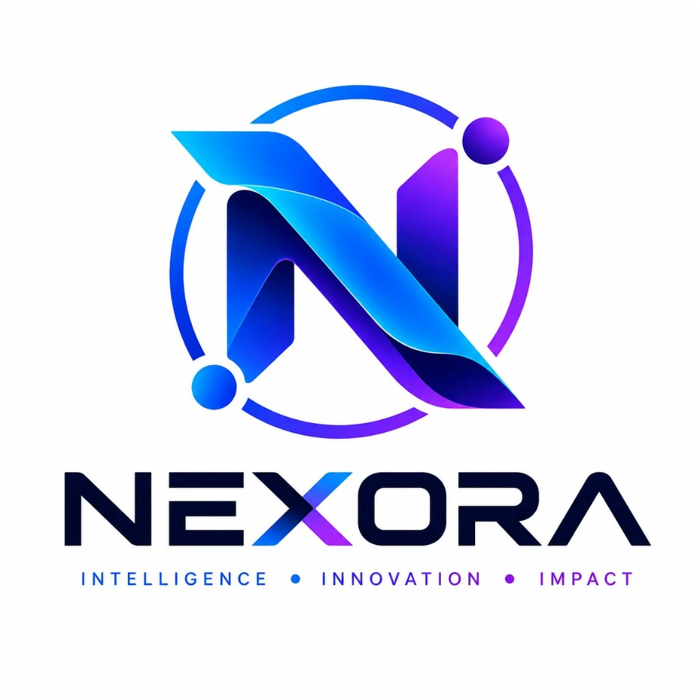

# 🚀 NEXORA — Financial Intelligence, Reimagined



**NEXORA** is a next-generation AI-powered startup and enterprise financial decision intelligence platform. Designed to turn complex, multi-entity financial ledgers into instant predictive decisions, automated risk alerts, and executive insights using neural-grade AI models and hands-free voice interaction.

> **Tagline**: *INTELLIGENCE • INNOVATION • IMPACT*

---

## ✨ Features & Platform Capabilities

### 1. 🎙️ AI Voice & Conversational Copilot System (v2.5)
- **Speech Recognition (Voice Input)**: Continuous hands-free voice capture powered by the Web Speech API (`SpeechRecognition` / `webkitSpeechRecognition`) for mobile & desktop.
- **Speech Synthesis (Voice Readout)**: Natural language audio readout ("Read Aloud") with instant playback controls for executive commentaries and financial telemetry.
- **Zero-Hallucination RAG Engine**: Deterministic SQL calculations executed over raw ledger events before RAG translates metrics into natural English.

### 2. 📊 Financial Analytics & OpEx Breakdown
- Real-time breakdown of **Revenue (₹24.8 Cr +18.4%)**, **Net Profit (₹6.42 Cr +12.8%)**, **Cash Flow (₹8.17 Cr +9.6%)**, and **Operating Expenses (₹16.63 Cr -3.2%)**.
- Period selectors (Q1 - Q4 2026) and granular departmental OpEx allocation analysis.

### 3. 🛡️ Risk Intelligence & Market Stress Simulator
- **Anomaly Detection Index (99.8%)** with active solvency threat monitoring.
- Interactive **Market Stress Simulator** with real-time Market Volatility Index (VIX) and Interest Rate Shock sliders.
- Automated immutable governance stream logging KYC, AML, and Basel III liquidity buffer checks.

### 4. 📈 Predictive Forecasting Engine
- Multi-scenario probability modeling: **Optimistic (P90)**, **Base Case (P50)**, and **Conservative (P10)**.
- **10,000 Monte Carlo trial runs** and Bayesian confidence interval ribbon charts.

### 5. 🌐 Interactive 3D WebGL Canvas & Perspective Cards
- Built using **Three.js (`three`)**: Interactive 3D WebGL financial node polyhedron with floating particle networks.
- **3D Perspective Tilt Cards (`Card3D.jsx`)**: Real-time perspective transforms (`rotateX`, `rotateY`) and glare overlays on hover.

### 6. 📱 Ultra-Sleek Mobile Menu & Responsive Layout
- Glassmorphic mobile menu drawer (`backdrop-blur-2xl`) with structured category badges (`Voice AI`, `Live`, `Hiring`).
- Integrated 1-tap `🎙️ AI Voice Copilot System` quick launcher banner in mobile drawer.

---

## 🌐 Live AI Ecosystem & Flagship Applications

Explore the suite of live AI decision intelligence platforms engineered by Ranjeet and the team:

| Project | Domain | Live Demo | Repository | Status |
| :--- | :--- | :--- | :--- | :--- |
| **CommunityPulse AI** | Decision Intelligence & Civic Insights | [Live Demo](https://communitypulse-static-prototype.vercel.app/) | [GitHub Repo](https://github.com/Ranjeet7680/CommunityPulse-AI-Decision-Intelligence-Platform.git) | 🟢 Production |
| **FinanceFit AI** | Financial Health & Fitness Engine | [Live Demo](https://financefit-ai.vercel.app/) | [GitHub Repo](https://github.com/Ranjeet7680/FinanceFit-AI.git) | 🟢 Production |
| **Voyage Analytics** | Maritime & Supply Chain Intelligence | [Live Demo](https://voyage-analytics.vercel.app/) | [GitHub Repo](https://github.com/Ranjeet7680/Voyage-Analytics.git) | 🟢 Production |
| **Recruit-AI (EnterpriseFlow)** | Enterprise AI Recruiter (Snowflake Ed.) | [Live Demo](https://enterprise-flow-ai-snowflake-editio.vercel.app/) | [GitHub Repo](https://github.com/Ranjeet7680/Recruit-AI-Enterprise-AI-Recruiter-Intelligence-System.git) | 🟢 Production |

---

## 🛠️ Technology Stack

| Layer | Technology |
| :--- | :--- |
| **Frontend Framework** | React 19, Vite 8, TypeScript |
| **Styling & Theme** | Tailwind CSS 4 (`@tailwindcss/vite`), White Theme System, Glassmorphic CSS |
| **Voice & Speech Engine** | Web Speech API (`SpeechRecognition`), Speech Synthesis (`window.speechSynthesis`) |
| **3D & Graphics** | Three.js (`three`), HTML5 WebGL Canvas, CSS 3D Perspective Transforms |
| **Icon Set** | Lucide React Icons (`lucide-react`) |
| **Backend API** | Python, FastAPI, Node.js, Celery, Redis |
| **AI / Machine Learning**| LLMs, Speech AI, RAG Engine, PyTorch, Scikit-Learn |
| **Data Lakehouse** | PostgreSQL, Google BigQuery, Vector Database |
| **Cloud Infrastructure** | Google Cloud Platform (GCP), Vercel, Docker, Kubernetes |

---

## 👨‍💻 Core Engineering Leadership

- **Ranjeet Kumar**: Lead Developer & AI Engineer ([LinkedIn](https://www.linkedin.com/in/ranjeet-kumar-78a45120b/) | [GitHub](https://github.com/Ranjeet7680) | [Hack2Skill](https://hack2skill.com/dashboard/user_public_profile/?userId=6817753bbd3f11d6144699e1&tabIndex=about&utm_source=hack2skill&utm_medium=homepage))
- **Abhishek Kantharia**: Full-Stack Developer ([LinkedIn](https://www.linkedin.com/in/abhishekkantharia1/) | [GitHub](https://github.com/AbhishekKantharia) | [Hack2Skill](https://hack2skill.com/dashboard/user_public_profile/?userId=68cda0a54f508360a04d19a3&tabIndex=about&utm_source=hack2skill&utm_medium=homepage))
- **GLS Santhosh**: AI/ML & Product Developer ([LinkedIn](https://www.linkedin.com/in/santhosh-gls/) | [GitHub](https://github.com/glssanthosh1306) | [Hack2Skill](https://hack2skill.com/dashboard/user_public_profile/?userId=6a75dde8d54c393d0f59ce5a&tabIndex=about&utm_source=hack2skill&utm_medium=homepage))

---

## ⚡ Getting Started Locally

### Prerequisites
- **Node.js** (v18.x or higher)
- **npm** or **yarn**

### Installation

1. Clone the repository:
   ```bash
   git clone https://github.com/Ranjeet7680/nexora-financial-intelligence.git
   cd nexora-financial-intelligence
   ```

2. Install dependencies:
   ```bash
   npm install
   ```

3. Launch the development server:
   ```bash
   npm run dev
   ```

4. Open your browser and navigate to:
   ```
   http://localhost:5173
   ```

### Production Build

To build the static application bundle:
```bash
npm run build
```

---

## 📜 License

© 2026 Nexora Financial Intelligence. All rights reserved.
